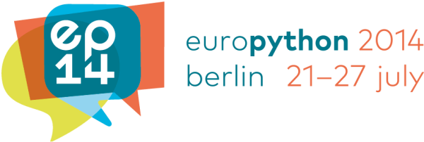

class: top, center

.left[

 ## https://ep2014.europython.eu/

]

.right[

 ## @europython

]

.left[

 ### 21 July 2014: Keynotes, Lightning talks

 ### 22-25 July 2014: Talks, Tutorials, Lightning talks

 ### 25 July 2014: Posters

 ### 26-27 July 2014: Sprints

]
---
class: top, center

## 27-31 July in Berlin, Germany

.left[

 ## http://pydata.org/

]

.right[

 ## @PyDataConf

]

.left[

 ### 25 July 2014: Tutorials

 ### 26-27 July 2014: Talks

]
