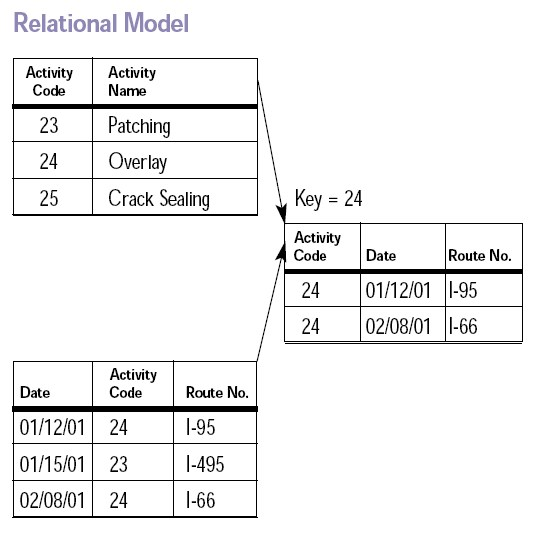

class: inverse
# What is a database ?

## Wikipedia: “A database is an organised collection of data for one or more purposes, usually in digital form.”
---
class: inverse

### Numpy arrays are a database ?

### CSV files are a database ?

### MySQL/PostgreSQL/Oracles are databases:

  - because of querying language ?
  - because of data modelling ?
  - because of storage ?
---

layout:false

.left-column[
  ## SQL from pandas
]

.right-column[
We can use pandasql to use SQL in data frames:

```
import pandas as pd
import pandasql

pysqldf = lambda: q: pandsql.sqldf(q, globals())

pydev = pd.read_csv("pydev_emails.csv")

q = """
SELECT
  p.from_col, COUNT(p.from_col) as c
FROM
  pydev p
GROUP BY
  p.from_col
ORDER BY
  c
"""

df = pysqldf(q)
```

So you can do SQL without databases
]

---
.left-column[
  ## Storage
]

.right-column[
Databases don`t store data in a single block, but use b-trees


Databases know a lot about doing IO efficiently:

- concurrent reading and writing

- dealing with random IO

Databases often the appropriate tool in those cases
]
---
.left-column[
  ## Data modeling
]

.right-column[
Relation modeling:



Data are 'normalized':

- redundancy is removed

- robust against deletion and changes
]
